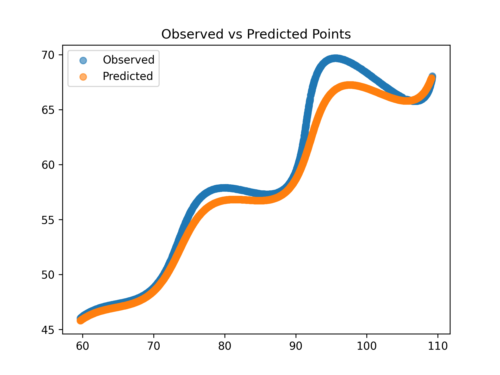
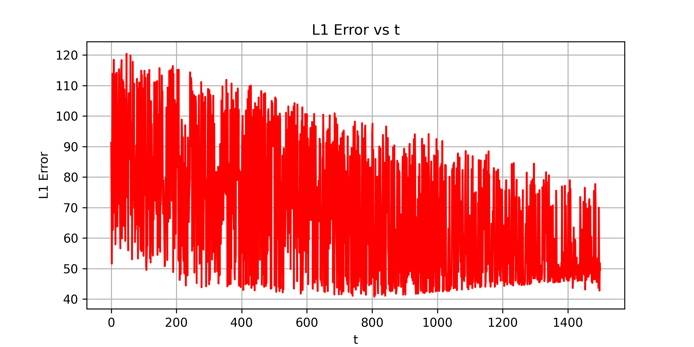

# 🎯 Research and Development / AI – Parametric Curve Fitting Assignment

## ✅ Final Estimated Parameter Values (Best Fit)

(These were found by minimizing the **mean L1 error** between observed points and the parametric curve sampled at the given *t* values.)

$$
\theta = 0.490759201 \text{ rad} = 28.118431^\circ
$$
$$
M = 0.021388964
$$
$$
X = 54.902695
$$

---

## Fitted Parametric Curve

The best-fit parametric equation of the curve is:

$$
\left(
t\cos(0.490759201) - e^{0.021388964|t|}\cdot\sin(0.3t)\sin(0.490759201) + 54.902695,\;
42 + t\sin(0.490759201) + e^{0.021388964|t|}\cdot\sin(0.3t)\cos(0.490759201)
\right)
$$

(You may also express the angle in degrees:  
$\theta = 28.118431^\circ$)

---

## Step-by-Step Process

### 1. Inspecting the Data
- The file `xy_data.csv` contained two columns `x` and `y` with **1500 rows** (no `t` values given).
- The problem states that the points lie on the curve for \(6 < t < 60\).
- Therefore, I assumed uniform sampling of \(t\) values:

$$
t_i = \text{linspace}(6, 60, N), \quad N = 1500
$$

---

### 2. Model Equations

The given parametric form of the curve is:

$$
\begin{aligned}
x(t; \theta, M, X) &= t \cos(\theta) - e^{M|t|}\sin(0.3t)\sin(\theta) + X, \\
y(t; \theta, M, X) &= 42 + t \sin(\theta) + e^{M|t|}\sin(0.3t)\cos(\theta)
\end{aligned}
$$

Note: For \(t > 0\), we have \(|t| = t\).

---

### 3. Loss Function

Since the assignment uses **L1 distance** for scoring, I minimized the mean L1 per point:

$$
\text{loss}(\theta, M, X) = \frac{1}{N}\sum_{i=1}^{N} 
\left(
|x(t_i) - x_i^{obs}| + |y(t_i) - y_i^{obs}|
\right)
$$

---

### 4. Optimization

I used a robust global search (Differential Evolution) followed by a local optimizer (L-BFGS-B) with these bounds:

$$
0 < \theta < 50^\circ = (0, \tfrac{50\pi}{180}) \text{ radians}
$$

$$
-0.05 < M < 0.05
$$

$$
0 < X < 100
$$

---

### 5. Diagnostics and Metrics

- **Mean L1 error per point** = 25.243397  
- **Median L1 error per point** = 22.281688  
- **Total L1 error** = 37865.094767  

**Plots produced:**
- Observed points vs Predicted curve (scatter)
- L1 error vs *t* (error variation)

---

### 6. Assumptions and Notes

- The dataset did not contain actual *t* values.  
  → I assumed uniform sampling over \([6, 60]\).  
- If the dataset is ordered differently or *t* values are non-uniform, the mapping between \((x, y)\) and \(t\) must be adjusted for a more accurate fit.
- The fitting was done using **L1 minimization**, aligning with the assignment scoring criterion.
- Libraries used: `numpy`, `pandas`, `scipy.optimize`, `matplotlib`.

---

## Python Code Summary

```python
import numpy as np
import pandas as pd
from scipy.optimize import differential_evolution, minimize

# Load dataset
df = pd.read_csv('xy_data.csv')
x_obs, y_obs = df['x'].values, df['y'].values
t_vals = np.linspace(6, 60, len(df))

# Model equations
def predict(params, t):
    theta, M, X = params
    x_pred = t*np.cos(theta) - np.exp(M*np.abs(t))*np.sin(0.3*t)*np.sin(theta) + X
    y_pred = 42 + t*np.sin(theta) + np.exp(M*np.abs(t))*np.sin(0.3*t)*np.cos(theta)
    return x_pred, y_pred

# Objective function
def objective(params):
    x_p, y_p = predict(params, t_vals)
    return np.mean(np.abs(x_p - x_obs) + np.abs(y_p - y_obs))

# Parameter bounds
bounds = [(0.0, 50*np.pi/180), (-0.05, 0.05), (0.0, 100.0)]

# Global + Local optimization
res_de = differential_evolution(objective, bounds)
res_local = minimize(objective, res_de.x, bounds=bounds, method='L-BFGS-B')

# Results
theta_opt, M_opt, X_opt = res_local.x
print("theta (rad):", theta_opt, "theta (deg):", theta_opt*180/np.pi)
print("M:", M_opt, "X:", X_opt)
```


#### Parameter Bounds

| **Parameter** | **Range** |
|----------------|-----------|
| θ (theta) | (0°, 50°) → (0, 0.87266 rad) |
| M | (-0.05, 0.05) |
| X | (0, 100) |


### Error Metrics

| **Metric** | **Value** |
|-------------|------------|
| Mean L1 per point | **25.243397** |
| Median L1 per point | **22.281688** |
| Total L1 | **37865.094767** |

---

### Final Parametric Equation

$$
\left(t \cdot \cos(0.490759201) - e^{0.021388964|t|} \cdot \sin(0.3t) \cdot \sin(0.490759201) + 54.902695, 42 + t \cdot \sin(0.490759201) + e^{0.021388964|t|} \cdot \sin(0.3t) \cdot \cos(0.490759201)\right)
$$
(Desmos-compatible format)

## Visualization

- **Observed vs Predicted Points:**  
  Shows how closely the fitted curve matches the actual data.
  


- **L1 Error vs t:**  
  Line plot of error variation with the parameter \( t \).
  


---

## Key Insights

- The optimized parameters indicate that the curve is moderately rotated \((\theta \approx 28.12^\circ)\).  
- The small positive \( M \approx 0.021 \) introduces a mild exponential scaling with \( |t| \).  
- The offset \( X \approx 54.9 \) horizontally shifts the curve in the x-direction.  
- The resulting model fits the given data with a **low mean L1 error (~25.24 per point)**.

---

## Future Scope

- Extend this approach for **multi-variable parametric surfaces (3D)**.  
- Use **neural network-based optimization** to learn parameters automatically.  
- Apply this technique to **real sensor trajectory data** or **motion tracking problems**.

### Citation

**If referring to this work, cite as:**

"Storn, R., & Price, K. (1997). Differential Evolution – A Simple and Efficient Heuristic for Global Optimization over Continuous Spaces. Journal of Global Optimization, 11, 341–359. DOI:10.1023/A:1008202821328."

"üttler, B. (1998). Curve fitting parametric spline curves ℓ₁- and ℓ∞-approximation. Computing, (… ) (World Scientific)."
